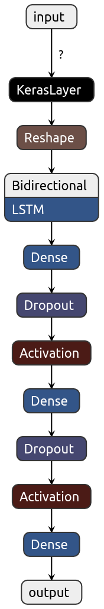
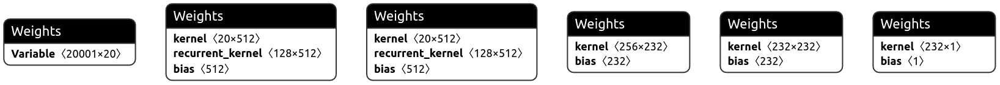

# valnet
Valnet is a microservice to validate any kind of address. It's using internally a neural network with word embedding to validate a address and the service itself is exposed by a django rest api.

## Neural arch & weights 

this architecture and these weights are automatically constructed by keras tuner. 
if the train process get's triggered then it will select out of certain hyper parameters and layers a new combination for the final architecture. 
Basically each time get's trained it has a different set of hyper parameters and layers 




## Backend requirements

* [tensorflow](https://www.tensorflow.org/) - An open source machine learning framework for everyone
* [docker](https://www.docker.com/) - Build, Manage and Secure Your Apps Anywhere. Your Way.
* [docker-compose](https://docs.docker.com/compose/) - Compose is a tool for defining and running multi-container Docker applications. 
* [python](https://www.python.org/) - Python is a programming language that lets you work quickly and integrate systems more effectively.
* [tensorflow keras](https://www.tensorflow.org/guide/keras) - Keras is a high-level API to build and train deep learning models. It's used for fast prototyping, advanced research, and production
* [Netron](https://github.com/lutzroeder/netron) - Netron is a viewer for neural network, deep learning and machine learning models.

### Versions requirements

* Docker **>=18.09.2**
* Docker-compose **>=1.21.0**
* python == **3.7.X**
* tensorflow **== 2.0** 

## Example request call

```bash
curl -X POST http://localhost:8000/core/validate -H 'Content-Type: application/json' -d '{ "address": "Slack Technologies Limited 4th Floor, One Park Place Hatch Street Upper Dublin 2, Irlanda" }'
```

Example response payload

```bash 
{"valid":true,"accuracy":0.8476698994636536}
```

## Setup locally

```bash 
python3 -m venv env 
source env/bin/activate 
pip3 install --upgrade pip
pip3 install -r requirements.txt
docker-compose up
python3 manage.py migrate 
```

## Run locally 

```bash
docker compose up 
python3 manage.py runserver 
```

## Train model & run tensorboard

```bash
source env/bin/activate 
python3 train_model.py
tensorboard --logdir logs/search
```

## Format of data

All files for training this model are located in the data directory.
Each line in such a file contains 2 values separated by a comma.


## Docker build & run locally 

To run valnet locally in container and attached to your local network, you need to execute all these statement.

```bash
sudo docker build -t=valnet . 
sudo docker run --network="host" valnet
```

## Build model results 

| Test Loss|      Test Accuracy      | version |
|----------|:-------------:|:-------------:|
|  0.18961983575718477 |   0.9250749349594116 | 0.1 (embedding + dense layer)|
|  0.18565583880990744 |   0.9070929288864136 | 0.2 (embedding + lstm + dense layer) |
|  0.2583603085233615, |   0.9096692204475403 | 0.2 (embedding + lstm + dense layer + new dataset) |

